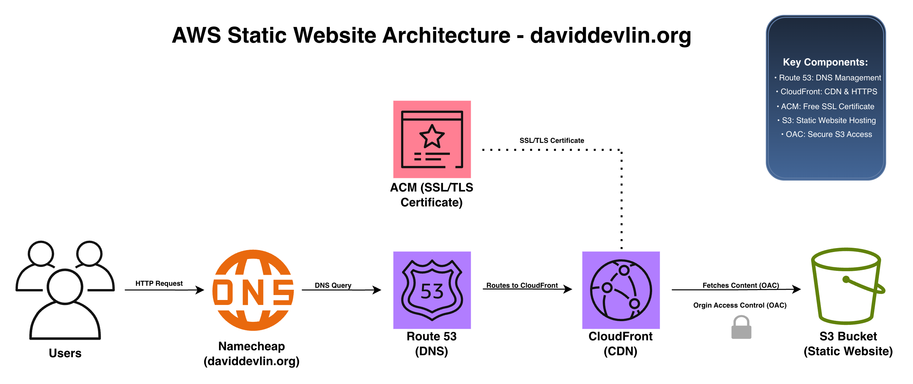

# AWS Static Website Hosting with CloudFront

A secure, scalable static portfolio website deployed on AWS infrastructure with global content delivery, custom domain, and SSL/TLS encryption.

**Live Site:** [https://daviddevlin.org](https://daviddevlin.org)

---

## 📐 Architecture

---

## 🎯 Project Overview

This project demonstrates the deployment of a production-ready static website using AWS services, following cloud best practices for security, performance, and cost optimization. The website serves as a professional portfolio showcasing my cloud certifications and projects.

### Key Objectives

- Deploy a secure static website with HTTPS
- Implement global content delivery via CDN
- Configure custom domain with DNS management
- Follow AWS security best practices (private S3 bucket with OAC)
- Maintain cost-effective infrastructure (~$14/year)

---

## 🛠️ Tech Stack

### AWS Services

- **Amazon S3** - Static website file storage (private bucket)
- **Amazon CloudFront** - Global CDN for content delivery
- **AWS Certificate Manager (ACM)** - Free SSL/TLS certificate
- **Amazon Route 53** - DNS management and domain routing
- **Origin Access Control (OAC)** - Secure S3 bucket access

### Frontend

- **HTML5** - Semantic markup
- **CSS3** - Responsive design with modern layouts
- **JavaScript** - Interactive elements
- **Font Awesome** - Icon library
- **Formspree** - Contact form backend

### Domain Registrar

- **Namecheap** - Domain registration (daviddevlin.org)

---

## ✨ Features Implemented

### Security
- ✅ **Private S3 Bucket** - Block all public access
- ✅ **Origin Access Control (OAC)** - CloudFront-only access to S3
- ✅ **HTTPS Enforcement** - Redirect all HTTP to HTTPS
- ✅ **SSL/TLS Encryption** - Free certificate via ACM
- ✅ **Least Privilege IAM** - Restricted bucket policies

### Performance
- ✅ **Global CDN** - CloudFront edge locations for low latency
- ✅ **Caching Optimization** - Configured cache behaviors
- ✅ **Compressed Assets** - Automatic gzip compression
- ✅ **HTTP/2 & HTTP/3** - Modern protocol support

### Functionality
- ✅ **Custom Domain** - Professional branding (daviddevlin.org)
- ✅ **www Subdomain** - Both root and www work seamlessly
- ✅ **Responsive Design** - Mobile, tablet, and desktop optimized
- ✅ **Contact Form** - Formspree integration for inquiries
- ✅ **Social Links** - GitHub and LinkedIn integration

---

## 📊 Cost Breakdown

### One-Time Costs
- Domain registration: **$7** (first year, $13/year after)

### Monthly AWS Costs
- **Route 53 Hosted Zone:** $0.50/month
- **S3 Storage:** ~$0.01-0.05/month (negligible for static site)
- **CloudFront:** Free tier (1TB/month for 12 months), then $0.085/GB
- **ACM SSL Certificate:** **FREE**

**Total Annual Cost: ~$13-18/year** (incredibly cost-effective for a professional portfolio)

## 🔒 Security Best Practices Implemented

### Defense in Depth

1. **Private S3 Bucket**
   - All public access blocked
   - Content only accessible via CloudFront

2. **Origin Access Control (OAC)**
   - Modern replacement for Origin Access Identity
   - IAM-based authentication
   - Bucket policy restricts access to specific CloudFront distribution

3. **HTTPS Only**
   - HTTP automatically redirects to HTTPS
   - TLS 1.2+ encryption
   - Free certificate auto-renewal via ACM

4. **Principle of Least Privilege**
   - S3 bucket policy grants only GetObject permission
   - Limited to specific CloudFront distribution ARN
   - No unnecessary IAM permissions

### Potential Future Enhancements

- AWS WAF for DDoS protection and rate limiting
- CloudFront signed URLs for private content
- S3 access logging for audit trails
- CloudWatch alarms for monitoring

---

## 🎓 Skills Demonstrated

- Cloud architecture design
- AWS service integration
- DNS management and configuration
- SSL/TLS certificate management
- CDN configuration and optimization
- Security best practices (OAC, private buckets, HTTPS)
- Cost optimization strategies
- Infrastructure documentation
- Web development (HTML/CSS/JavaScript)

---

## 📚 Lessons Learned

### Technical Insights

1. **ACM Certificate Region Matters**
   - CloudFront requires certificates in us-east-1
   - Easy to miss but critical for success

2. **DNS Propagation Takes Time**
   - Nameserver changes can take up to 48 hours
   - Plan accordingly and be patient

3. **OAC vs OAI**
   - Origin Access Control (OAC) is the modern approach
   - Provides better security and IAM integration

4. **CloudFront Caching**
   - Invalidations needed after content updates
   - Cache policies significantly impact performance

5. **Default Root Object**
   - Must be explicitly set to `index.html`
   - Otherwise, CloudFront returns Access Denied

### Best Practices

- Always block S3 public access for security
- Use alias records in Route 53 (not CNAME for root domain)
- Enable S3 versioning for rollback capability
- Test via CloudFront URL before configuring custom domain
- Document architecture with diagrams

---

## 🔮 Future Enhancements

### Planned Improvements

- [ ] **AWS WAF Integration** - Add web application firewall for security
- [ ] **CI/CD Pipeline** - Automate deployments with GitHub Actions
- [ ] **CloudWatch Monitoring** - Set up alarms and dashboards
- [ ] **Cost Optimization** - Implement S3 lifecycle policies
- [ ] **Performance Testing** - Load testing and optimization
- [ ] **Access Logging** - Enable S3 and CloudFront logs
- [ ] **Lambda@Edge** - Add serverless functions for dynamic features
- [ ] **Multi-Region Failover** - Implement Route 53 health checks

### Potential Advanced Features

- Serverless contact form with API Gateway + Lambda + SES
- Dynamic content with DynamoDB integration
- User authentication with Cognito
- Blog functionality with S3 + Lambda
- Analytics dashboard with CloudWatch

---

## 📖 Resources & References

### AWS Documentation
- [Amazon S3 Static Website Hosting](https://docs.aws.amazon.com/AmazonS3/latest/userguide/WebsiteHosting.html)
- [Amazon CloudFront Developer Guide](https://docs.aws.amazon.com/AmazonCloudFront/latest/DeveloperGuide/)
- [AWS Certificate Manager User Guide](https://docs.aws.amazon.com/acm/latest/userguide/)
- [Amazon Route 53 Developer Guide](https://docs.aws.amazon.com/Route53/latest/DeveloperGuide/)

### Helpful Tutorials
- [AWS Static Website Workshop](https://catalog.workshops.aws/)
- [CloudFront with S3 Origin](https://aws.amazon.com/blogs/networking-and-content-delivery/)

---

## 🤝 Connect With Me

- **Portfolio:** [daviddevlin.org](https://daviddevlin.org)
- **LinkedIn:** [linkedin.com/in/david-devlin-897057368](https://www.linkedin.com/in/david-devlin-897057368/)
- **GitHub:** [github.com/davidcyberprojects](https://github.com/davidcyberprojects)
